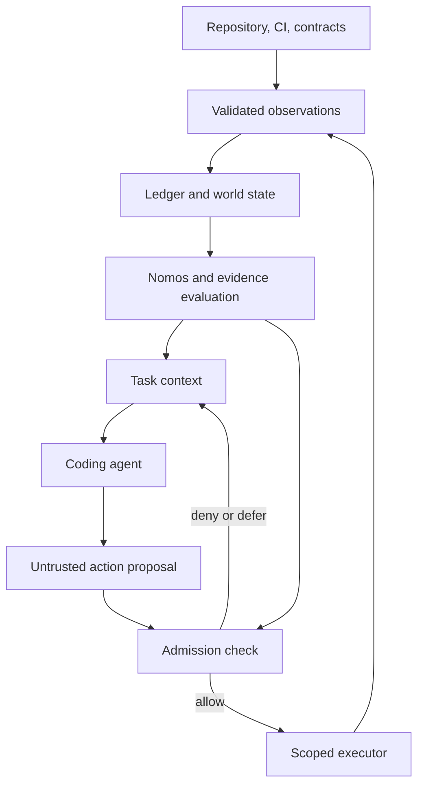

# Axiom: detailed design and implementation plan

> Historical planning input supplied by the owner. Repository access and
> implementation have since begun; current state is in `docs/roadmap.md` and
> `specs/0001-offline-kernel/`. The original proposal is retained below.

Status: proposed design, not an accepted implementation spec.

Prepared: 2026-09-20.

Target: `stillzhl/axiom`.

Scope: the reusable Axiom harness and its Nomos symbolic rules subsystem. All consumer-specific policies, requirements, fixtures, evidence, and integration code belong in the consumer repository. This document intentionally contains no HomeKV milestone assumptions or integration configuration. GitHub access failed in this session; repository contents and existing policies have not been inspected. All paths below are proposed.

## 1. Product definition

**Axiom is a symbolic supervision layer for coding agents.** It combines explicit requirements, repository observations, deterministic rules, and executable evidence to decide which actions are admissible and which completion claims are supported.

**Nomos is Axiom's symbolic rules subsystem.** It evaluates dependency constraints, allowed scope, evidence obligations, and state-transition preconditions.

The coding model proposes plans and patches. Axiom observes their results and evaluates them against versioned contracts. Axiom's value is measurable reduction in invalid actions, stale evidence, repeated work, and unsupported completion claims.

Taglines:

- Axiom — make agents prove their work.
- Nomos — deterministic laws for nondeterministic agents.

The first tagline is branding. The technical contract must distinguish test evidence, review attestations, bounded model checking, and formal proof. A passing test is an observation about one execution, not a proof of every behavior.

### Initial user journeys

1. A developer asks what work is ready and receives eligible tasks with missing prerequisites explained.
2. An agent proposes a patch and receives specific scope or policy violations.
3. A reviewer asks whether a PR satisfies completion policy and receives an evidence-linked decision for an exact candidate identity.
4. A maintainer replays a past decision and sees the policy, observations, and rule results that produced it.
5. Later, an agent works through a constrained executor that checks proposals before dispatch and observations afterward.

### Non-goals for v1

- A general theorem prover or automatic proof of arbitrary source-code correctness.
- Automatic interpretation and acceptance of arbitrary prose requirements.
- Universal detection of weakened assertions or architecture violations.
- A replacement compiler, build system, code host, or CI runner.
- An agent that receives unrestricted credentials and is expected to obey a prompt.
- Distributed scheduling, a web dashboard, embeddings, vector search, or a graph database.
- Live mutation of consumer repositories merely because the supervisor reports an action admissible.

## 2. Fundamental guarantees and limits

| Contract | What Axiom can establish | What remains outside that guarantee |
| --- | --- | --- |
| Dependency readiness | Every declared prerequisite has qualifying evidence or an explicit accepted baseline | The dependency list itself is complete |
| Change scope | Observed changes match configured path/component constraints | All semantic effects stay within those paths |
| Test gate | An approved producer reported the required test outcomes for the selected candidate and environment | Tests comprehensively specify the implementation |
| Spec completion | Every required obligation meets the agreed evidence policy | Universal correctness of the requirement |
| Decision replay | The same recorded inputs and engine/policy version yield the same decision | An external test rerun or LLM generation is deterministic |
| Enforcement | The controlled executor and protected merge path reject inadmissible actions | Actors with independent credentials cannot bypass Axiom |

These limits must be visible in the CLI, documentation, and evidence schema. Never label a requirement simply `proven` when its strongest evidence is a test run.

## 3. Architecture and module responsibilities

Use a single Clojure JVM application with a pure core and side-effecting adapters. Start as a CLI; keep the API usable from a future long-running supervisor.

| Namespace | Responsibility | Boundary |
| --- | --- | --- |
| `axiom.model` | Versioned schemas, IDs, canonical representation, validation | No I/O |
| `axiom.world` | Reduce normalized events into immutable state | No network or wall-clock reads |
| `axiom.nomos` | Evaluate policy and admissible transitions | Pure deterministic functions |
| `axiom.prover` | Match qualified evidence to obligations; build support explanations | Does not promote claims to observations |
| `axiom.ledger` | Append, transact, replay, snapshot, and migrate events | Persistence boundary |
| `axiom.context` | Generate a bounded task projection with references | Cannot authorize actions |
| `axiom.contract` | Load declarative contracts; validate source mappings | Never evaluates repository code |
| `axiom.adapters.git` | Observe commits, trees, worktrees, and changes | Normalizes Git output |
| `axiom.adapters.github` | Observe PRs, reviews, runs, jobs, and artifact metadata | Network and provider boundary |
| `axiom.adapters.runner` | Execute configured verification commands and collect results | Isolated worker boundary |
| `axiom.agent` | Provider-neutral agent request/response protocol | Generated output is untrusted |
| `axiom.executor` | Validate proposals, acquire leases, dispatch allowed actions | Owns scoped capabilities |
| `axiom.cli` | Commands, exit codes, text/EDN/JSON output | Thin orchestration layer |

The `Prover` name is retained, but initially the module is an evidence evaluator. A future formal-verifier adapter may produce stronger evidence with explicit assumptions and proof-checker identity.

The trust-sensitive flow is:



Start with ordinary maps, sets, vectors, and functions. Add Datalog only if actual query complexity warrants it. Add SMT only for specific bounded obligations whose solver models and assumptions can be reviewed.

## 4. Core domain model

### 4.1 Entity types

| Entity | Essential fields |
| --- | --- |
| Repository | Stable provider ID, current slug, default branch, allowed observation sources |
| Spec revision | Spec ID, content digest, declared lifecycle state, approval reference, parent references |
| Task revision | Task ID, spec revision, dependencies, allowed scope, obligation IDs |
| Requirement revision | Requirement ID, source anchor/digest, obligation definitions, evidence policy |
| Component | ID, normalized path rules, ownership metadata, optional semantic analyzers |
| Candidate | Repository ID, base/head/tree/merge identities, contract and policy digests |
| Observation | Producer identity, subject identity, value, provenance, collection scope |
| Claim | Agent identity, statement, proposed evidence references; never authoritative by itself |
| Evidence | Kind, producer, candidate, run identity, result, artifact digest, applicability |
| Decision | Action, candidate, policy, world revision, result, reasons, support graph |
| Authorization | Capability issuer, actor, permitted action/scope, expiry, revocation state |
| Lease | Repository/task, holder, expiry, monotonic fencing token |

Stable IDs are strings; keywords represent a fixed vocabulary of field names and states. External JSON uses an explicit documented mapping of keyword keys to strings. Do not auto-intern arbitrary unbounded external strings as keywords.

### 4.2 Separate normative, observed, and claimed facts

- **Normative:** what policy requires and which spec revision was accepted.
- **Observed:** what Git, a trusted runner, or a provider API reported.
- **Claimed:** what an agent, issue description, or PR author says is true.
- **Derived:** what a versioned rule concludes from specified normative and observed inputs.

Do not rank all information with one universal precedence list. A spec is authoritative about intended behavior; Git about commit identity; the approved CI producer about its run result. A spec's `Verified` label cannot overrule a failed required check on a new revision.

Contradictory relevant observations produce a conflict. Missing or stale observations produce unknowns. Lower-authority tracker prose may be flagged as drift, but never silently rewritten.

### 4.3 Evaluation semantics

Each obligation evaluates to `:satisfied`, `:violated`, or `:unknown`.

- Satisfied: qualifying evidence meets the obligation's declared policy.
- Violated: valid observations establish a failed mandatory condition.
- Unknown: evidence is missing, stale, incomplete, conflicting, or from an unapproved source.

An action decision is `:allow`, `:deny`, or `:defer`. Any violated mandatory condition denies the action. With no violations but any unknown mandatory condition, defer. Malformed contracts fail validation and produce no executable decision.

Never use an empty obligation set as accidental success. Every gated action declares a nonempty obligation set, unless its schema explicitly marks it as an observation-only action.

## 5. Contracts and source authority

Consumer repositories own `.axiom/contract.edn` and `.axiom/policy.edn`. Axiom ships their schemas, validator, and synthetic examples.

Use a two-part authoring model:

1. Markdown holds rationale and natural-language requirements.
2. A versioned declarative manifest holds stable IDs, dependencies, accepted revisions, scope, and evidence obligations, each linked to a Markdown anchor and digest.

Where the two disagree, validation blocks the relevant action until reconciled. Axiom does not guess which text was intended.

An LLM-assisted importer may propose manifest entries, but a maintainer accepts them through the repository's normal review process. Parse only a documented Markdown/front-matter subset. Ambiguous tables or prose must remain unresolved, not become invented facts.

Illustrative consumer contract, with synthetic IDs:

```clojure
{:schema/version 1
 :project/id "sample-project"
 :specs [{:id "S-001"
          :revision "sha256:SPEC_DIGEST"
          :state :accepted
          :approval "approval-001"}]
 :tasks [{:id "T-002"
          :spec "S-001"
          :depends-on #{"T-001"}
          :allowed-components #{"codec"}
          :obligations #{"O-001" "O-002"}}]
 :obligations [{:id "O-001"
                :requirement "R-001"
                :kind :test-suite
                :suite "codec-conformance"
                :required-profile "linux-jdk21"}
               {:id "O-002"
                :kind :review-attestation
                :purpose :requirement-test-mapping}]
 :components {"codec" {:paths ["src/codec/**" "test/codec/**"]}}}
```

Validate duplicate IDs, missing references, cycles, unknown states, empty gates, ambiguous component ownership, unsupported schema versions, and unresolved source digests. Unknown contract fields are errors in strict v1 mode; extensions require a declared schema version.

Do not impose Axiom's proposed spec lifecycle on all repositories. Consumer policy maps its established lifecycle into admissibility predicates. Historical verified baselines are imported with provenance and a declared trust level, not fabricated retrospective test evidence.

## 6. Nomos design

### 6.1 Rule engine

Implement named, pure evaluators first:

```clojure
(evaluate-obligation world policy candidate obligation)
(evaluate-action world policy candidate proposal)
(ready-tasks world policy)
(explain-decision world decision-id)
```

Rules emit structured results with rule ID/version, status, evaluated subjects, supporting evidence IDs, missing inputs, and remediation suggestions. Store the resulting support graph so explanations do not depend on an LLM reconstructing reasoning.

Repository policy selects built-in predicates and parameters. It cannot provide arbitrary Clojure functions, macros, shell expressions, dynamically loaded namespaces, or `eval` forms. Clojure code-as-data is useful for trusted engine development; it is not a reason to execute policy submitted in a PR.

### 6.2 Initial rule set

| Rule | Required behavior |
| --- | --- |
| Accepted spec | Implementation refers to a specifically accepted spec revision |
| Dependencies | Every declared prerequisite qualifies; reject cycles during loading |
| Scope | All changed old/new paths and file modes satisfy active component policy |
| Evidence completeness | Every mandatory obligation has admissible support |
| Candidate binding | Evidence subject matches the selected candidate identity |
| Producer trust | Source identity and verification recipe match the trust policy |
| Freshness | Current observations are sufficiently recent for the decision type |
| Conflicts | Relevant contradictory observations block admission |
| Policy integrity | Candidate cannot approve itself by weakening the governing policy |
| Authorization | Requested side effect requires an independently issued capability |
| Lease ownership | Mutating action carries the current task lease/fencing token |

Keep rule ordering deterministic. Prefer collecting all applicable blockers over returning only the first failure. Explain applicability so irrelevant gates are not treated as failures.

### 6.3 Policy changes

For an implementation PR, evaluate against the approved target-branch policy or a separately approved policy revision. A PR's proposed relaxed policy cannot govern its own admission.

Policy/spec changes have a separate review class and authority. An agent may propose them, but its proposal does not authorize their acceptance. Existing authorization from the project owner may be encoded explicitly; the engine must not manufacture it.

## 7. Evidence design

### 7.1 Evidence record

```clojure
{:schema/version 1
 :evidence/id "ev-001"
 :kind :test-result
 :producer {:kind :ci
            :provider "github"
            :repository-id "provider-repository-id"
            :workflow-id "workflow-id"
            :workflow-digest "sha256:WORKFLOW_DIGEST"
            :run-id "run-id"
            :attempt 1
            :job-id "job-id"}
 :subject {:repository-id "provider-repository-id"
           :head "HEAD_SHA"
           :base "BASE_SHA"
           :tested-commit "TESTED_SHA"
           :tested-tree "TREE_SHA"
           :contract-digest "sha256:CONTRACT_DIGEST"
           :policy-digest "sha256:POLICY_DIGEST"}
 :obligation "O-001"
 :result :pass
 :environment {:profile "linux-jdk21"
               :toolchain-digest "sha256:TOOLCHAIN_DIGEST"}
 :artifact {:sha256 "ARTIFACT_DIGEST"
            :media-type "application/json"
            :location "artifact-reference"}
 :observed-at "2026-09-20T12:00:00Z"}
```

These are schema examples, not real run identifiers or results.

### 7.2 Qualification pipeline

1. Validate shape, size, source, repository, and referenced entities.
2. Identify the authenticated collector and approved execution producer; never trust a submitted `trusted: true` field.
3. Bind the evidence to candidate, obligation definition, verification recipe, environment, and attempt.
4. Check completion status, artifact availability/digest where required, and superseding or revoked records.
5. Match it against the obligation's allowed evidence kinds and success conditions.
6. Derive an obligation result with explicit limitations.

An artifact checksum establishes content identity. It does not establish that a trustworthy test produced the artifact. A successful CI job is insufficient if it ran a candidate-modified recipe that can skip verification.

Treat selected completed reruns explicitly. Never aggregate an older pass with a newer failure to report success, and never mix partial matrix results from incompatible attempts. Required matrix members are enumerated by contract.

### 7.3 Evidence invalidation

Reevaluate when any relevant input changes: head/base/tested tree, contract or requirement definition, governing policy, workflow recipe, required environment, evidence revocation, approval dismissal, task lease, or verification engine version.

Historical evidence stays in the ledger; applicability changes. Do not erase history or imply an earlier valid decision was always invalid.

For v1, prefer full revalidation after candidate changes. Incremental evidence reuse is a later optimization that requires an explicit sound dependency model. A docs-only change is not automatically exempt.

### 7.4 Semantic review and test preservation

Path checks and diff heuristics can flag removed assertions, deleted tests, changed expected values, or disabled jobs. They cannot prove that assertions were not weakened. Require an attestation from an authorized reviewer for changes in sensitive verification code, and bind that attestation to the exact revision.

Test counts are informative and may satisfy a declared numeric gate, but counts do not establish coverage. Requirement-to-test mappings need review and later adversarial or mutation testing on selected critical obligations.

## 8. Candidate identity and merge safety

Record at least repository ID, PR number where relevant, base SHA, head SHA, tested commit, tested tree, contract digest, policy digest, evaluator version, and verification recipe digest.

Head-only CI does not establish compatibility with a moving base. Prefer merge-group testing where supported. GitHub documents the `merge_group` event for checks required by a merge queue: [GitHub merge queue documentation](https://docs.github.com/en/repositories/configuring-branches-and-merges-in-your-repository/configuring-pull-request-merges/managing-a-merge-queue).

`can-merge` is an observation-bound policy decision, not a durable permission token. Before any later merge action, refresh relevant provider state and rerun admission against the current identity.

For actual enforcement, the final identity check must be coupled to a provider-enforced atomic update, protected merge queue, or an equivalent race-safe mechanism. A final REST reread alone does not close the race between checking and merging. If the available host cannot guarantee the required candidate identity, v1 must keep the merge action unsupported and provide advisory results.

Squash and rebase may create a different final commit. Accept tree equivalence only under a declared policy that also covers parent-sensitive tests and commit-dependent build inputs. Otherwise require validation of the resulting candidate.

## 9. Ledger, replay, and persistence

M1 uses an in-memory event sequence for the pure kernel. M2 introduces a single-process SQLite ledger with EDN payloads, schema versions, transactionally assigned sequence numbers, and unique deduplication keys. SQLite supplies the transactional storage foundation; crash behavior still requires testing of our own append protocol and configuration. [SQLite transactional guarantees](https://www.sqlite.org/transactional.html).

Suggested tables:

| Table | Purpose |
| --- | --- |
| `events` | Ordered immutable facts about observations, claims, decisions, and actions |
| `artifacts` | Content digests, media types, sizes, retention status, locations |
| `snapshots` | Derived world state with sequence, reducer version, and digest |
| `leases` | Active lease state and fencing tokens |
| `action_outbox` | Durable action intents, dispatch state, and reconciliation IDs |

Event envelope: event ID, schema version, stream ID, sequence, deduplication key, producer, observed time, ingestion time, candidate ID, payload digest, payload. A reducer consumes events in ledger order; external timestamps never become an assumed global causal order.

Record time-dependent evaluations as explicit inputs. Replay at a recorded decision time reproduces the historical decision; evaluating now may legitimately produce stale evidence.

Canonical encoding must be versioned and tested. Do not hash arbitrary printed map/set order. Define recursive key/set ordering and a restricted scalar vocabulary; reject ambiguous or unsupported values. Preserve the original artifact bytes separately when their byte identity matters.

Hash chaining can detect some tampering, but an attacker who controls the whole database can rewrite the chain. Do not call a local ledger tamper-proof. Stronger attestation needs trusted external checkpoints or signatures and key-management boundaries, deferred beyond the initial MVP.

Crash scenarios:

- Event append commits before dispatch: outbox recovery determines whether to dispatch.
- External action succeeds before result recording: reconcile with the provider using an operation ID and observed state before retrying.
- Outcome cannot be established: mark it indeterminate and block dependent mutations.
- Snapshot is missing or incompatible: replay from validated events.

Promise idempotent or reconciled effects where feasible, not universal exactly-once external execution.

## 10. Agent protocol and enforcement

### 10.1 Context projection

Provide the agent with goal/task identity, accepted spec references, relevant source excerpts, allowed scope, mandatory obligations, current blockers, prior attempt summaries, and source handles for deeper inspection.

Attach world revision, policy digest, candidate ID, and any lease token. A summary does not replace source code or detailed requirements. If an agent needs more information, it can request approved read operations.

Context generation must not hide unknowns to save tokens. Token budget limits should remove low-priority history before normative requirements and current blockers.

### 10.2 Action proposal

```clojure
{:schema/version 1
 :proposal/id "proposal-001"
 :actor "agent-001"
 :world/revision 42
 :candidate/id "candidate-001"
 :task/id "T-002"
 :action :apply-patch
 :patch/artifact "sha256:PATCH_DIGEST"
 :expected-head "HEAD_SHA"
 :lease/fence 7}
```

The executor validates the current world, capability, candidate, scope, and lease before applying the patch. Paths claimed in the proposal are hints; independently inspect actual patch effects and the resulting worktree diff.

### 10.3 Isolation and capability boundary

The agent runs in an isolated worktree/container with no direct merge credential, no ledger write capability, and no ability to modify active policy in the supervisor. Axiom's supervisor remains outside that environment.

Treat repository build scripts and tests as arbitrary code. Run them in separate constrained workers with bounded CPU, memory, process count, time, storage, and network policy. Workspace path allowlists alone are not a sandbox. Test workers do not inherit supervisor/provider secrets.

Verification commands refer to approved command IDs with structured arguments. Avoid shell interpolation. Commands that intentionally use a shell are explicit, reviewed recipe choices with the same isolation boundary.

Tools are capabilities: read source, propose patch, apply admitted patch, run named verification, publish branch, create PR, or merge. Each requires an applicable authorization. Nomos may say a merge is policy-admissible while the actor still lacks permission to execute it.

### 10.4 Bounded execution loop

Observe → project context → request proposal → validate → execute → collect evidence → evaluate → continue or stop.

Stop on completion, exhausted attempts/budget, repeated equivalent failures, cancellation, unresolved side effects, expired authorization, or a blocker requiring an external decision. Provider choice is an adapter; start with a scripted fake agent for deterministic tests, then one real coding-agent integration.

## 11. Repository layout and delivery interfaces

Proposed Axiom-owned paths:

| Path | Contents |
| --- | --- |
| `README.md` | Project definition, supported commands, limitations, quick start |
| `AGENTS.md` | Contributor workflow and accepted-spec discipline |
| `deps.edn` | Pinned runtime and test/build dependencies |
| `src/axiom/` | Generic modules listed above |
| `test/axiom/` | Unit, property, replay, and integration tests |
| `resources/axiom/schemas/` | Versioned public contract and event schemas |
| `examples/synthetic-project/` | Invented consumer fixture with no real-project facts |
| `specs/0001-foundation/` | Requirements, design, tasks, verification record |
| `docs/architecture.md` | Trust boundaries and module contracts |
| `docs/protocol.md` | EDN/JSON normalization and action/evidence protocol |
| `docs/roadmap.md` | Milestones and current completion evidence |
| `.github/workflows/ci.yml` | Axiom's own verification workflow |

Consumer repositories own their `.axiom/` contracts, requirement-to-test mappings, component rules, integration workflows, and project-specific fixtures. Runtime state belongs in a configurable local application directory or service store, ignored by Git; avoid committing secrets, large logs, or mutable evidence databases.

Initial CLI surface:

```bash
axiom validate --repo PATH
axiom status --repo PATH
axiom next --repo PATH
axiom explain --decision DECISION_ID
axiom evaluate --repo PATH --task TASK_ID --candidate CANDIDATE_ID
axiom replay --ledger PATH --through EVENT_ID
```

Later commands:

```bash
axiom check-pr --repo OWNER/REPO --pr NUMBER
axiom can-merge --repo OWNER/REPO --pr NUMBER
axiom supervise --repo PATH --task TASK_ID --agent ADAPTER
```

Machine output supports EDN and JSON; diagnostic logs go to stderr. Proposed decision exit codes: 0 allow/success, 2 deny, 3 defer/unknown, 4 invalid contract, 5 operational failure. Read-only reporting commands return 0 when a valid report was produced and include readiness separately; automation should use decision commands for gate semantics.

Ship an executable JVM distribution/launcher once CLI behavior is stable. Pin Clojure, JDK, dependency, linter, formatter, and CI action versions when implementing; do not describe an unverified version as latest. No JVM dependency is introduced into a consumer's ordinary application build.

Read contracts as bounded EDN using `clojure.edn`, with an explicit tag/type policy, exactly one top-level value, and trailing-input rejection. Byte, nesting, collection, and parse-time limits require additional checks or isolation; the reader alone does not provide them. [Official clojure.edn API](https://clojure.github.io/clojure/clojure.edn-api.html).

## 12. Spec-driven implementation sequence

Each phase follows: inspect current repository → write requirements/design/tasks/verification gates → accept through the project's authority → implement a bounded slice → record evidence → advance status only when its gates pass. This document does not itself accept any spec.

### M0 — Design and repository bootstrap

Deliver:

- Inspect existing default branch, repository instructions, open work, CI, and license before editing.
- README, architecture/protocol ADRs, contribution guide, roadmap, and Draft foundation spec.
- Minimal Clojure project, test runner, pinned toolchain, lint/format configuration, and CI.
- Synthetic fixtures and a documented trust/evidence vocabulary.

Gate: a clean checkout runs the documented checks; no consumer-specific content; proposed versus implemented behavior is clearly labeled. Preserve an existing license and do not invent a licensing decision if none exists.

### M1 — Pure symbolic kernel

Implement:

- Versioned contract, observation, claim, evidence, and decision schemas.
- Strict manifest validation and deterministic candidate normalization.
- In-memory event reducer with explicit time inputs.
- Accepted-spec/dependency/scope/evidence-binding rules.
- `validate`, `status`, `next`, `evaluate`, and structured explanations.
- A synthetic example with incomplete, stale, failing, and sufficient evidence scenarios.

Gate: a submitted claim cannot unlock an obligation; malformed or incomplete input cannot allow a gated action; identical inputs replay identically; candidate mutation invalidates earlier evidence; all denial/defer results name reasons. A synthetic trusted producer is explicitly test-only.

This is the first useful MVP. It is an offline evaluator, not a secure production supervisor.

### M2 — Durable ledger and local observations

Implement:

- SQLite transactions, event uniqueness, schema migrations, replay, and rebuildable snapshots.
- Local Git adapter for clean/dirty worktrees, base/head/tree identities, and full change enumeration.
- Artifact digesting and bounded retention metadata.
- Local diagnostic verification runner with timeout/cancellation; mark its evidence according to its actual trust level.
- `replay` and decision export bundles.

Gate: duplicate and out-of-order observations are handled deterministically; interrupted writes do not create successful phantom actions; snapshots match replay; renames/deletions/symlinks/submodules are handled or explicitly blocked; local results cannot masquerade as trusted remote CI.

### M3 — GitHub and CI observation

Implement:

- Read-only collection of PR identity, full changed-file lists, runs, jobs, attempts, approvals, and relevant artifacts.
- Complete pagination and observation completeness markers.
- Rate-limit/error handling, bounded retries, and cache invalidation.
- Producer and workflow identity validation; matrix and rerun selection.
- `check-pr` and advisory `can-merge` with exact evidence links.

Gate: missing API pages, permission errors, fork ambiguity, expired required artifacts, base/head changes, skipped required jobs, and unknown check conclusions never become success. Recorded provider fixtures reproduce decisions offline.

### M4 — Enforced verification gate

Implement:

- Trusted evaluation workflow or dedicated GitHub App path appropriate to deployment permissions.
- Approved-policy loading independent of candidate content.
- Check publication bound to the candidate and evaluator identity.
- Protected branch/merge-queue integration, including merge-group evaluation where available.
- Governance change handling and explicit authorization separation.

Gate: a candidate cannot pass by editing policy, replacing the verifier, renaming a check, omitting required verification, or presenting a stale success. Document protection assumptions and administrator bypasses. If host enforcement cannot be configured, report advisory mode instead of claiming enforcement.

External protection/permission changes require the repository owner's authorization; producing the software does not grant that authority. Use a deployment-specific capability check before selecting a Checks API writer. [GitHub Checks API documentation](https://docs.github.com/en/rest/checks/runs).

### M5 — Supervised agent execution

Implement:

- Context projection, structured proposal protocol, and fake-agent adapter.
- Isolated worktrees/workers, capability dispatch, action outbox, leases, and fencing.
- Patch admission and post-action verification.
- One real agent adapter with timeout, cancellation, output validation, and cost/attempt budgets.
- PR publication only when separately authorized; automatic merge remains a distinct optional capability.

Gate: two runs cannot mutate the same leased task concurrently; stale workers cannot publish; unauthorized shell/tool requests are rejected; crashes after external success reconcile safely; prompt text cannot override policy; the complete synthetic task completes through the guarded loop.

### M6 — Consumer pilot and v1 release validation

Axiom deliverables:

- Generic integration guide, pinned distribution, schema compatibility policy, support bundle tooling.
- Reproducible evaluation harness with synthetic and independently chosen holdout tasks.
- Performance/resource budgets, migration tests, release checklist, and known limitations.

Consumer deliverables are implemented and reviewed in their own repositories under their own specs. Their rollout starts with observations, then advisory decisions, then selected enforced gates. Do not duplicate their configurations or evidence in Axiom.

Gate: satisfy the v1 criteria in Section 15 and demonstrate measured reliability benefit before enabling broad autonomous use.

### Dependency order and proposed PR slices

| PR slice | Scope | Depends on |
| --- | --- | --- |
| 01 | Design, ADRs, Draft foundation spec | Current repository inspection |
| 02 | Runtime/test/CI bootstrap | Accepted bootstrap scope |
| 03 | Schemas and contract validation | 01–02 |
| 04 | Event reducer and candidate identity | 03 |
| 05 | Nomos decisions and support explanations | 04 |
| 06 | Offline CLI and synthetic examples | 05 |
| 07 | SQLite ledger, replay, recovery tests | 06 |
| 08 | Git observations and path safety | 07 |
| 09 | Bounded runner and evidence adapters | 08 |
| 10 | Read-only GitHub/CI collector | 09 |
| 11 | PR decisions and invalidation scenarios | 10 |
| 12 | Trusted CI gate and policy integrity | 11 |
| 13 | Leases, outbox, isolated executor | 12 |
| 14 | Context and fake-agent end-to-end loop | 13 |
| 15 | One real agent adapter and budgets | 14 |
| 16 | Evaluation, packaging, release validation | 15 |

These are work boundaries, not a requirement for exactly sixteen PRs. Split further if a slice cannot be reviewed or verified independently. No calendar promise is justified before M1 validates the schemas and runtime assumptions.

## 13. Verification strategy

The evaluator is security- and correctness-sensitive. Test its admission behavior against independently specified expected outcomes, not merely implementation-shaped examples.

| Area | Required cases |
| --- | --- |
| Contract loading | Duplicate IDs, cycles, missing references, unknown states/fields, extra top-level values, oversized/deep input |
| Evidence | Wrong repo/head/base/tree/profile, missing artifact, forged producer, skipped check, failed rerun, incomplete matrix |
| Policy | Candidate policy relaxation, unknown predicate, missing approval, empty mandatory gate |
| Paths | Rename old/new paths, deletion, traversal, symlink escape, file-mode change, Unicode names, submodules |
| Ledger | Duplicate delivery, crash around commit, incompatible snapshots, partial artifact retention, replay across migration |
| GitHub | Pagination failure, stale cache, rate limits, permission failure, force push, dismissed review, base movement |
| Execution | Timeout, cancellation, outbox uncertainty, stale fencing token, unauthorized tool request, secret isolation |
| Context | Mandatory blockers preserved under token limit; projection cannot change authoritative decisions |

Property tests should establish, under fixed policy and valid preconditions:

- Adding unsupported agent claims cannot turn deny/defer into allow.
- Removing required evidence cannot create allow.
- Changing candidate identity makes old candidate-bound evidence inapplicable.
- Reordering irrelevant set/map input does not change canonical decisions.
- A new blocking observation can retract a previously admissible current decision without deleting its historical record.
- Replaying a committed ledger prefix yields the same world and decision for the recorded engine/version/time.
- Duplicate producer delivery does not duplicate logical effects.

Use an independent expected-results corpus for adversarial admission cases. Later perform mutation testing on selected rules and require that deliberately bypassed checks are detected. Record known gaps; do not represent a clean test suite as proof that no bypass exists.

## 14. Operational and performance plan

Start with one supervisor per store and a serialized action dispatcher. Avoid a distributed control plane before the single-process semantics are correct.

Observe decision latency, evidence collection latency, ledger growth, replay time, blocker frequencies, retries, conflicts, agent attempts, and external costs. Give every decision/action/run a stable correlation ID.

Proposed benchmark targets, to be confirmed after M1:

- Warm local task evaluation under one second on a published reference machine for a fixture with 1,000 tasks and 10,000 evidence records.
- Memory use remains within a configured process budget; fail safely when collection limits are reached.
- External API latency is measured separately from pure evaluation.
- Cold JVM startup and whole-ledger replay are reported separately, not hidden inside a favorable warm-path metric.

Set explicit defaults for payload sizes, pagination budgets, retries, worker limits, evidence retention, and timeout behavior during implementation. Exceeding a collection bound produces incomplete/unknown state, not truncated success.

Store credential references, never credentials, in contracts and events. Redact secret-bearing logs before persistence. Artifact URLs may expire; retain durable IDs and content digests, with retention policy distinguishing audited historical decisions from presently reproducible verification.

## 15. Measuring whether Axiom helps

Compare the same agent/model/tool budget on matched tasks, with and without Axiom. Use isolated branches, fixed starting commits, several repetitions, randomized task order, and independent evaluation of results. Preserve failures in the dataset; do not score only completed runs.

Primary outcomes:

- Invalid completions admitted: the most serious error.
- Valid completions blocked: friction and policy-quality signal.
- Human intervention rate and reasons.
- Task success under a fixed time/cost budget.
- Scope violations, stale-evidence reuse, repeated work, and omitted gates.
- Agent tokens, CI executions, wall-clock time, and total cost per accepted result.

Policy fixtures are not the sole benchmark: reserve holdout tasks and negative cases not used to develop Nomos. Report uncertainty and raw counts. Reduced token usage is a hypothesis, not a promised benefit; maintaining reliable state may increase cost on simple tasks.

**Proposed v1 exit criteria:**

1. All mandatory foundation requirements map to passing acceptance evidence at a pinned release candidate.
2. Versioned contract/event/decision schemas and migrations are documented and tested.
3. Mandatory gates fail closed on unknown, stale, malformed, or contradictory inputs.
4. Ledger replay reproduces decisions with pinned inputs and engine identity.
5. Trusted gate deployment demonstrably resists candidate modification of its policy/evaluator.
6. At least one supervised coding task completes through isolated execution, evidence collection, and reviewable PR publication in an authorized test environment.
7. All predefined adversarial admission cases are rejected or explicitly deferred; residual limitations are documented.
8. A consumer pilot demonstrates useful results with independently reviewed evidence; its project-specific material remains in its own repository.
9. Installation, resource limits, recovery, cancellation, and support-bundle procedures work from a clean environment.

## 16. Design decisions and remaining questions

Recommended defaults:

- Clojure JVM; plain data and pure functions first.
- Nomos built-in predicates with declarative configuration.
- EDN contracts plus explicit JSON interchange mapping.
- In-memory kernel, then SQLite durability.
- Read-only GitHub observation before write-capable enforcement.
- Synthetic fixtures in Axiom; consumer fixtures remain in consumer repositories.
- Local CLI first; dashboard, Datalog, SMT, and distributed scheduling later if justified.

Resolve at the relevant implementation phase:

- Existing Axiom license and contribution requirements after access is restored.
- How spec acceptance is recorded and who may issue approvals.
- GitHub deployment capabilities, trusted-check identity, and merge-queue availability.
- First real agent adapter and its authentication/isolation model.
- Required evidence retention and whether formal proof adapters have a concrete use case.

The immediate next deliverable is the design/spec PR and a separately reviewable offline Nomos kernel. No current repository state, accepted milestone, implementation, test result, or enforcement capability is claimed by this plan.
